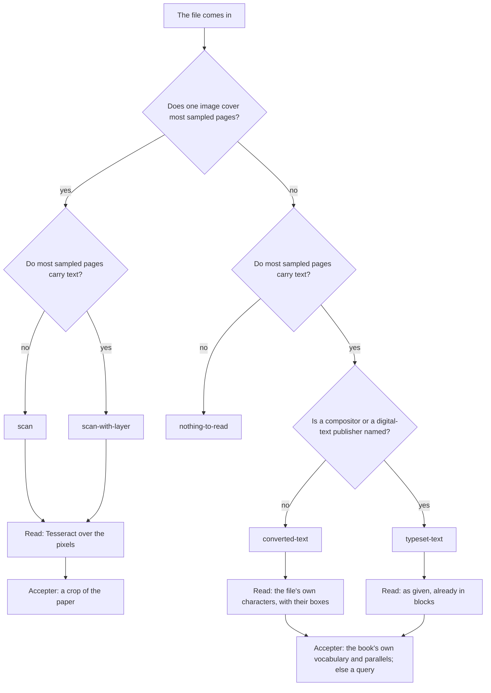

# The flow, by the shape of the book

Not every book presented has the same parts, and the process documents are
written for the fullest case — a photographed volume with nothing but pixels.
This page says what changes when the book is something else. It is the
flowchart [`PROCESS-reading.md`](./PROCESS-reading.md) lacked: that document
says what each stage does, and this one says **which stages a given book gets
and why**.

The table under the chart is **generated** from `src/core/provenance/route.ts`
by `node scripts/shape.mjs --flow`, and `test/provenance.test.ts` fails when
the two disagree. Edit the code, regenerate, commit both. A document written
beside the rule is how ten books went without a ledger; a document written
_from_ the rule cannot drift from it.

## First, what is the book made of?

Three questions, each a fact about the file rather than a guess about its
words. Every book file records the answers as `run.shape`
(`src/core/provenance/shape.ts`), measured off the file when it comes in and
declared by a person, with a reason, where nothing here can measure it.

- **Are there pixels?** Is each page a photograph of paper? Decided
  structurally: does one image cover the page? Only pixels can accept a
  reading, so this decides whether the propose/accept loop has anything to
  accept with.
- **What text does the file carry, and where did it come from?** `none`;
  `converted`, somebody's OCR — of the pixels beside it, or of paper nobody
  has; or `typeset`, characters a person typed or a compositor set. A converted
  layer is made of words shaped exactly like right ones and passes every
  measure of word shape, so **the default is `converted`** and `typeset` needs
  a compositor or a digital-text publisher named in the file. The safe error
  costs a free damage sweep. The other error stamped 81,743 words confidence
  100 on a book that needed 350 corrections.
- **Is there a second digitisation?** A reading that shares no blind spot with
  ours. True by construction for a scan carrying an OCR layer — the layer is
  archive.org's or Google's reading, not this app's — and false for a text
  layer with no pixels unless somebody has found one and declared it.

```
node scripts/shape.mjs <book-dir>            # measure the book's scan, print the shape and route
node scripts/shape.mjs <book-dir> --write    # …and record it in book.json
node scripts/shape.mjs --shelf books/        # one row per book: shape, how, route
node scripts/shape.mjs <book-dir> --declare '{"pixels":true,"textLayer":"none","externalText":false,"container":"pdf"}' --because "…"
```

`book-files.mjs --finish` owes a book with no recorded shape, because a book
whose route nobody knows cannot say its checks ran.

## Then, which route



The stages that turn on the shape are listed below; everything a book gets
regardless — assembly, the coherence checks, the sense pass, the query gate,
the ledger, layout and export — is not, because a table that says yes in every
column is not a table.

<!-- prettier-ignore-start -->
<!-- routes:begin — generated by `node scripts/shape.mjs --flow`; do not edit by hand -->

| | `scan` | `scan-with-layer` | `converted-text` | `typeset-text` |
| --- | :---: | :---: | :---: | :---: |
| **What it is** | A scan with no text layer | A scan carrying somebody's OCR layer | Somebody's OCR with no pixels behind it | Typeset text, no page images |
| **The free reading** | `ocr` | `ocr` | `text-layer` | `as-given` |
| **What accepts a reading** | pixels | pixels | the book itself | the book itself |
| Vet the harvested terms (Gate 1) | ✓ | ✓ | — | — |
| Draft each leaf from its geometry, correct it against the leaf (Stages 2–3) | ✓ | ✓ | — | — |
| Clean the page image before OCR | ✓ | ✓ | — | — |
| A second OCR reader, compared word for word | ✓ | ✓ | — | — |
| Adjudicate every finding against a crop (Stage 8) | ✓ | ✓ | — | — |
| Adjudicate against the book itself, with a query where it cannot answer (Stage 8b) | — | — | ✓ | ✓ |
| Sweep for conversion damage, and refuse an export that carries it (Stage 6b) | ✓ | ✓ | ✓ | ✓ |
| Set heading levels and lost line breaks by hand | — | — | ✓ | — |

### `scan` — A scan with no text layer

- ✓ **Vet the harvested terms (Gate 1)** — OCR read the words, so what it read is worth vetting
- ✓ **Draft each leaf from its geometry, correct it against the leaf (Stages 2–3)** — the leaf is the witness; the draft is what it is checked against
- ✓ **Clean the page image before OCR** — the pixels are what OCR reads, and what cleaning improves
- ✓ **A second OCR reader, compared word for word** — a second OCR shares no blind spot with the first
- ✓ **Adjudicate every finding against a crop (Stage 8)** — a crop of the paper is the only accepter
- — **Adjudicate against the book itself, with a query where it cannot answer (Stage 8b)** — the paper answers; the book need not stand in for it
- ✓ **Sweep for conversion damage, and refuse an export that carries it (Stage 6b)** — free, and what it finds is settled against the leaf
- — **Set heading levels and lost line breaks by hand** — the draft measures levels and breaks off the leaf

### `scan-with-layer` — A scan carrying somebody's OCR layer

- ✓ **Vet the harvested terms (Gate 1)** — OCR read the words, so what it read is worth vetting
- ✓ **Draft each leaf from its geometry, correct it against the leaf (Stages 2–3)** — the leaf is the witness; the draft is what it is checked against
- ✓ **Clean the page image before OCR** — the pixels are what OCR reads, and what cleaning improves
- ✓ **A second OCR reader, compared word for word** — the file’s own layer is already a second digitisation — compare against it first
- ✓ **Adjudicate every finding against a crop (Stage 8)** — a crop of the paper is the only accepter
- — **Adjudicate against the book itself, with a query where it cannot answer (Stage 8b)** — the paper answers; the book need not stand in for it
- ✓ **Sweep for conversion damage, and refuse an export that carries it (Stage 6b)** — free, and what it finds is settled against the leaf
- — **Set heading levels and lost line breaks by hand** — the draft measures levels and breaks off the leaf

### `converted-text` — Somebody's OCR with no pixels behind it

- — **Vet the harvested terms (Gate 1)** — nothing here read the words, so there is nothing to vet
- — **Draft each leaf from its geometry, correct it against the leaf (Stages 2–3)** — a render of such a leaf is the text layer drawn again — not a witness
- — **Clean the page image before OCR** — there is no page image to clean
- — **A second OCR reader, compared word for word** — no pixels for a second reader to read
- — **Adjudicate every finding against a crop (Stage 8)** — a crop is the hypothesis shown back to the adjudicator; refused
- ✓ **Adjudicate against the book itself, with a query where it cannot answer (Stage 8b)** — the book’s own vocabulary and repeated passages are the only witness; a place they cannot settle is raised as a query
- ✓ **Sweep for conversion damage, and refuse an export that carries it (Stage 6b)** — the words are shaped like right ones and this is what catches them
- ✓ **Set heading levels and lost line breaks by hand** — a text layer carries neither heading levels nor line breaks

### `typeset-text` — Typeset text, no page images

- — **Vet the harvested terms (Gate 1)** — nothing here read the words, so there is nothing to vet
- — **Draft each leaf from its geometry, correct it against the leaf (Stages 2–3)** — the text arrives in blocks already
- — **Clean the page image before OCR** — there is no page image to clean
- — **A second OCR reader, compared word for word** — no pixels for a second reader to read
- — **Adjudicate every finding against a crop (Stage 8)** — no paper to crop
- ✓ **Adjudicate against the book itself, with a query where it cannot answer (Stage 8b)** — a finding still needs a witness, and the book is the one there is
- ✓ **Sweep for conversion damage, and refuse an export that carries it (Stage 6b)** — free; expected to find nothing, and a run that finds something says the shape is wrong
- — **Set heading levels and lost line breaks by hand** — the file carries its own structure

### `nothing-to-read` — Neither pixels nor text

- the file has nothing to read; find the scan or the text and start again

<!-- routes:end -->
<!-- prettier-ignore-end -->

## What the route does not decide

- **The one rule holds on every route.** A model may propose a reading; only
  the accepter may accept one. On a route whose accepter is the book itself,
  a place the book cannot settle is a **query for the editor**, never a
  correction — `DamageFinding.confidence` carries `attested` or `shape` so the
  sheet lists the two apart.
- **A declared shape is a claim.** It is on the ledger with its reason beside
  it, exactly where a measurement puts its numbers. A session that finds the
  claim wrong changes the declaration and says why, in the same place.
- **The route is per book, not per leaf.** A scanned volume with a typed title
  page is a scan; the majority of sampled leaves decides. A collection built
  from readings of several shapes is declared, with the shapes of its parts
  named in the reason, and is read by its parts.
